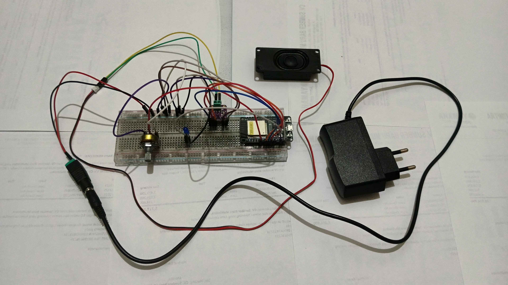
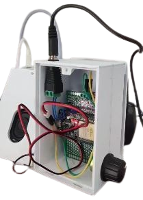
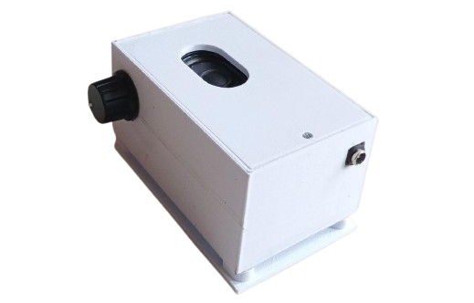

# **MedTime IoT Device**
`Smart Medication Reminder with Mobile App Integration`

## 📌 Overview  
MedTime IoT Device is a smart hardware extension designed to work seamlessly with the **MedTime Mobile Application**. This device provides real-time audio reminders to ensure medication adherence, especially for elderly users.

When a scheduled reminder is triggered from the app, the device will automatically play a voice notification using Google Text-to-Speech.

This system helps caregivers and patients maintain consistent medication routines through both digital and physical alerts.

## 👥 Team Members  
- `71220821 - Stefani Hartanto`
- `71220869 - Nicholas Dwinata`
- `71220885 - Angela Sekar Widelia`
- `71230986 - Ivan Roberto Halim`

## ⚙️ Features  
- 🔔 Real-time medication reminder synced with mobile app  
- 🔊 Audio notification using Google Voice (Text-to-Speech)  
- 🎛️ Adjustable volume control via potentiometer  
- 💡 Visual indicator using LED  
- 📡 IoT-based communication using ESP32  

## 🧩 Hardware Components  
- ESP32  
- LED  
- Potentiometer  
- Speaker  
- I2S Audio Amplifier  

## 🛠️ Tech Stack  
- 💻 Firmware Development: `Arduino IDE`
- 🌐 Backend / TTS Processing: `Node.js`
- 🔊 Text-to-Speech: `Google Voice (via API)`

## 🧠 How It Works  
1. User sets medication schedule in the MedTime mobile app  
2. Data is sent to the backend server  
3. When the time is reached:  
   - Backend generates voice using Google TTS  
   - Audio is sent to the IoT device  
4. ESP32 processes and plays the audio through the speaker  
5. LED indicator activates as additional alert  

## 📸 Project Showcase  

  
  

- Device enclosure (3D printed case)  
- Internal wiring & circuit design  
- Prototype breadboard setup  

## 📄 Notes  
This MedTime IoT Device were developed as part of our participation in the `Program Kreativitas Mahasiswa – Pengabdian Masyarakat (PKM-PM)` organized by the Ministry of Education, Culture, Research, and Technology of Indonesia (Kemendikbudristek).
